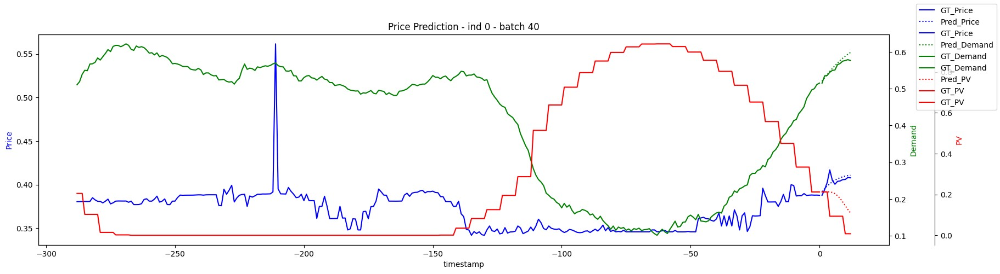
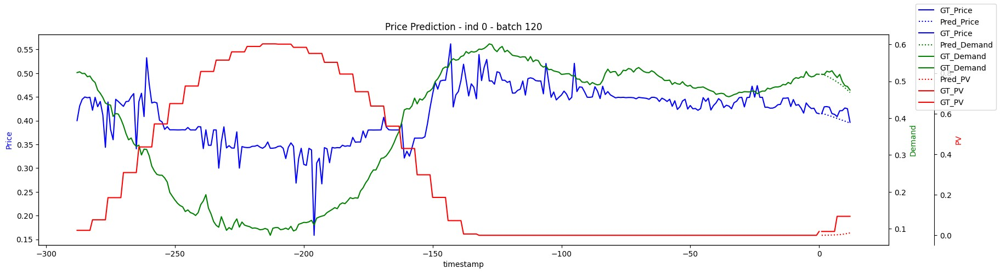
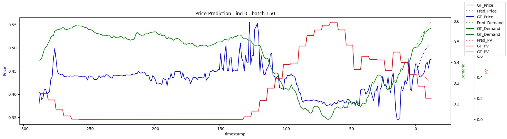
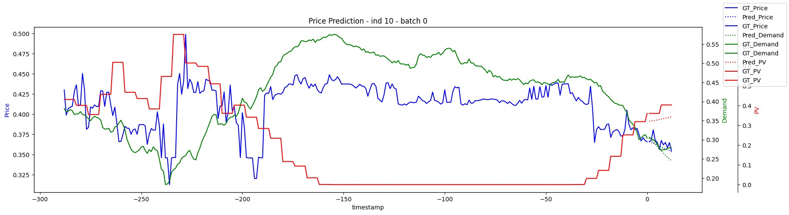
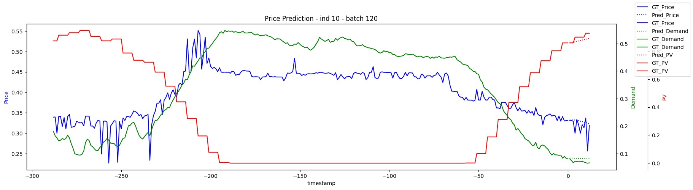
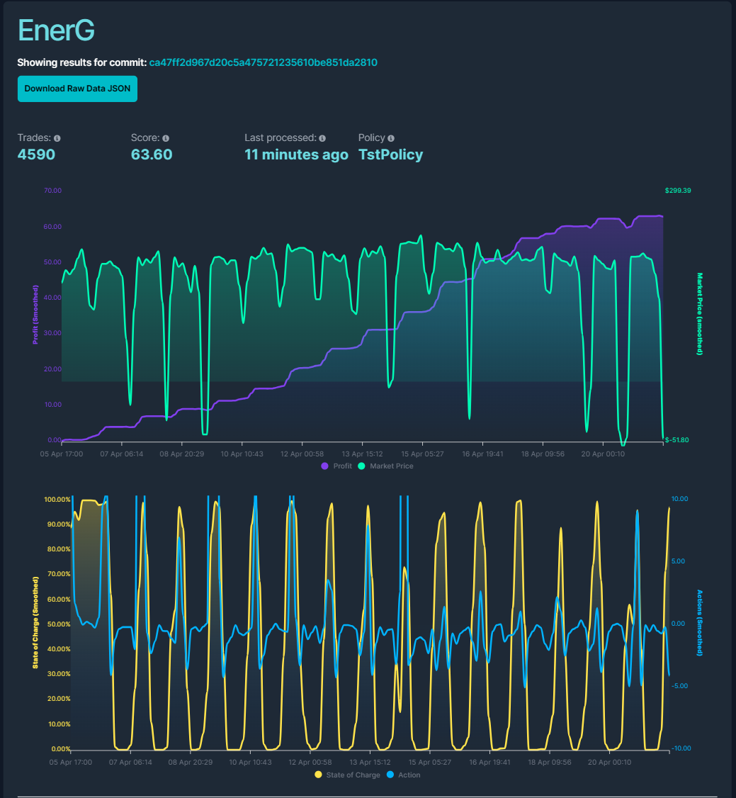

# Energy Trading Agent using Time Series Transformer

## Introduction

This is a project for the MLAI Green Battery Hackathon. In this competition, each team need to design a strategy to trade the electric power to maximize the profit.

A simulated solar panel and a battery are assigned to each team. The solar panel and battery are connected to the grid. Every 5 minutes, each team need to decide how much power from the solar panel goes the the battery and how much power should the battery charge from or discharge to the grid. The rest of the power generated from the solar panel will then be sent to the grid and converted to profit (or incur some cost when the electric price is negative).

Historical data is given. The most important features are the electric price, the power demand, and the estimated power generated by solar panels.

## Approach

### Step 1: Data analysis, Normalization and Outlier Removal

I plotted the correlation matrix of the data and selected the most important features which are `price`, `demand`, `pv_power`, and `temp_air`. I noticed that the data has seasonal trends and also the `pv_power` is periodical.

Also, in the data, there are some times that the price and demand are significantly high. The average electric price is around 80 AUD, however, the maximum price is 16600 AUD. Therefore, I plotted the distribution of the price and demand data and decide using the 25th percentile and 75th percentile as the minimum and maximum. I truncate data that are outside this range and then converted the price and demand data into a log scale.

### Step 2: Model Selection

I decide to use machine learning to predict the future electric price, demand, and solar power (pv_power). And then my policy will make decisions based on the predicted future features.

As the data is periodical and the period is around 24 hours, selecting an ML model that can capture the long-term data relationship of a time series is crucial. I decided to use **time series transformer (TST)** as my main prediction model as transformer is proved to capture long-term relationship and attend global information better than LSTM.

I trained the TST model to take the past 24 hour of `price`, `pv_power`, `demand`, `temp_air` as input to predict the next 1 hour of `price`, `pv_power`, and `demand`.

AdamW was used as an optimizer with a weight decay of 0.01 to prevent some weights from growing too much and dominating other features.

### Step 3: Trade Agent

During the test, I found that to make a big profit, it is important to capture the peaks and valleys. The agent needs to buy power from the grid when the price is at the lowest point and sell the power to the grid when the price is at the highest point. Also, you need to ensure your battery has electricity before the price reaches the peak so that you have enough to sell.

Therefore, I used the moving average method with a window to reference the past 1 hour's historical data and the next 1 hour's predicted data to capture the peaks and valleys.

Also, a charging gate was set to encourage the agent to accumulate electricity at a low price and be prepared when the price reaches the peak.

The tariffs are also formulated into the constraints. At peak times, there is a penalty for buying power from the grid and at off-peak times, there is an encouragement for selling power to the grid.

## Result

### TST Prediction Results

The graphs below indicate the prediction performance of my time series transformer model. The solid line is the ground truth data and the dotted line is the prediction. We can see my model can predict the overall trends well. However, the sudden fluctuations are not captured well. 











### Trading Performance

The image below illustrates the trading performance on an undisclosed hold-out dataset. The actions taken by my model, along with its battery charging state, correspond closely with the market price’s peaks and troughs. Furthermore, there’s a consistent growth in profit, which substantiates the model’s effective capture of these peaks and valleys. Impressively, the model’s performance ranked within the top 10 in the competition.



## Limitation

While my model is adept at identifying significant peaks and valleys, and can make appropriate decisions based on these observations, it falls short in detecting minor price fluctuations. Consequently, it doesn’t optimize profit through continuous power trading. Instead, it only reacts to substantial price drops or increases


# Official National Energy Market Hackathon Guide

## Competition Overview

Welcome to the [MLAI Green Battery Hack!](https://www.mlai.au/hackathon) In this competition, you'll develop a strategy to optimize battery operations within an energy market simulation. Your challenge is to create algorithms, or policies, that expertly manage battery charging and discharging in **response to real-time market data and incoming energy from a simulated solar panel**.


## Key Components of the Repository

- `bot/evaluate.py`: Code which runs your policy against local data. **NEVER ALTER THIS FILE** or all your submissions will fail.
- `bot/environment.py`: The code which makes up the simulated battery + solar panel setup. **NEVER ALTER THIS FILE** or all your submissions will fail.
- `bot/plotting.py`: Utility to visualize outcomes like actions taken, market prices, battery SoC (State of Charge), and profits.
- `bot/data/`: Data used to run unit tests and a training/validation split which mirrors the exact data you will encounter during live trading.
  
    - `training_data.csv`: Historical energy data in exactly the same format as the live data. You can use for testing training models.
    - `validation_data.csv`: A validation set in exactly the same format as the live data. You can use for testing models on unseen data after training on the training set.
- `bot/requirements.txt`: keeps track of all python packages you are using
- `bot/config.json`: The file which tells `evaluate.py` which policy from `bot/policies` will be used to run the battery. You can alter this but keep the format the same.

    > We need to modify this, change the class name of the policy you want to submit. 
- `bot/test_*`: these are unit tests
- `bot/Dockerfile`: only used during submissions. This will help package your code into a reusable bundle that will be run by the submission system.
- `bot/dockertest.py`: **a final test to run before submitting**. It runs your policy against test data using docker and yout `bot/Dockerfile`. This will throw errors if your code is not correctly set up for a submission.
- `bot/DO_NOT_TOUCH`: do not touch these files! They are a working copy of `bot/evaluate.py` and `bot/environment.py`. They are used by `bot/dockertest.py` to confirm that you haven't altered those files (which you must never alter).
- `bot/policies/`: Folder containing different policy classes for battery operation.
  
  - `policy.py`: Base class for all policies.
  - `random.py`: A simple policy making random decisions.
  - `historical_prices.py`: An example of a policy which uses external data (this data must also be included in bot).
  - `rolling_average.py`: A more complex policy based on market price averages.
  - `__init__.py`: Script to automatically load and register policy classes.

You can change any file in this repo except `bot/evaluate.py` and `bot/envoronment.py`. We use these files when running your code so if you change these files you could cheat very easily. If you DO alter these files our code will pick up on it and your submissions will error.

## Installation

### mac/linux

1. Make sure you have python 3.8 or greater installed you can check with `python --version` or `python3 --version`
2. Create a "virtual environment" which is a specific python environment you will use for running this repo. `python -m venv venv`
    - This will create a `venv` directory in the project root. `.gitignore` has been set up to make sure git will ignore this whole directory and it will never be tracked.
    - You can confirm this has worked by going `ls` and hopefully you will see something like 
  ```
  README.md       bot             design          venv
  ```
3. activate the virtual environment `source venv/bin/activate`. This will push your terminal inside the virtual environment. From now on all `pip install` and other `pip` commands will install within this specific environment. You can tell you are inside the virtual environment because it will show up at the start of the active line in your terminal 
```
(venv) plato@loukas-Laptop bot % 
```

4. Install dependencies `pip install -r bot/requirements.txt`
    - You can confirm this has worked by using `pip list` to list all installed dependencies and it should show you a similar list of packages as what is sitting in `bot/requirements.txt`

5. Now everything should be installed correctly, but to be sure let's run the unit tests. `python -m pytest`. This will run the tests in `bot/test_environment.py` and `bot/test_evaluate.py`. If they all pass it means everything is set up correctly and you're ready to roll.

### Windows

God help you.🙃

## Usage

### Running an Existing Strategy

The simplest thing you can do with this repo is evaluate the currently chosen policy (i.e. the chosen class from `bot/policies/*`, chosen using `bot/config.json`) against a chosen set of data using `python bot/evaluate.py --data bot/data/april15-may7_2023.csv --output_file output.json --plot`. This will run the policy against the `--data` file and automatically present you with a summary graph of what the policy did. It will look something like 


The data which is graphed will also be available in `json` format in the `--output_file` in this case `output.json`.

**REMEMBER: NEVER ALTER bot/evaluate.py** or all your submissions will fail. You can't even add a print statement. If you want to use it to develop make a copy and name it something else and develop from that.

### Build your own Strategy

### Step 1: Develop Your Policy
Create your custom policy by extending the `Policy` class in a new file inside `bot/policies`, e.g. `bot/policies/my_policy.py`. Feel free to extend any of the existing policy classes. Your job will be to create your own `act(external_state, internal_state)` function which makes smart decisions about how to charge and discharge the solar panel and battery.

A good policy will charge the battery (form the grid and the panel) when the market price looks like it's going to be low and discharge both when it looks like it will be high, while avoiding the battery being too full or empty to take advantage of very high or low prices.

### Step 2: Test and Evaluate
Use `bot/config.json` to choose which policy to use. You do this by setting "class_name" to the name of the policy class you would like to adopt as your policy for this submission. 

Next utilize `bot/evaluate.py` to run simulations of your policy under various market conditions. This will help you understand the effectiveness of your strategy. **NEVER EDIT bot/evaluate.py**.

### Step 3: Visualize and Refine
You can use `bot/plotting.py`, or your own plotting function to graphically analyze the performance of your policy. Use these insights to refine and improve your approach. The plot will look something like:


### Data

This is a brief description of all the columns in `bot/data/training_data.csv` which are the same as in `bot/data/validation_data.csv` and the live data you will be trading against.

`timestamp`: The time this row was recorded.
`price`: The electricity spot price for South Australia in **$/MWh**. Provided by [opennem](https://opennem.org.au/).
`demand`: The total electricity demand in **MW** for South Australia for large stable consumers (e.g. factories, mines, etc.) in MW. Provided by the legends at [opennem](https://opennem.org.au/).
`demand_total`: The total "scheduled generation" demand + the non-scheduled demand (small, unpredictable consumers) in **MW**. Provided by [opennem](https://opennem.org.au/).
`temp_air`: The air temperature in degrees Celsius in an indicative location in South Australia.
`temp_min`: The minimum temperature in degrees Celsius in an indicative location in South Australia.
`temp_max`: The maximum temperature in degrees Celsius in an indicative location in South Australia.
`exports`: The total electricity **exported from** South Australia in MW. **NOTE** this is not in the live data. Provided by [opennem](https://opennem.org.au/).
`imports`: The total electricity **imported into** South Australia in MW. **NOTE** this is not in the live data. Provided by [opennem](https://opennem.org.au/).
`pv_power`: The rate of power generated by the **simulated solar panel** in **kW**. Provided by [solcast](https://solcast.com/).
`pv_power_forecast_1h`: A forecast of what the `pv_power` will be in 1 from the `timestamp`. This data is missing for the first 2 years of training data. Provided by [solcast](https://solcast.com/).
`pv_power_forecast_2h`: A forecast of what the `pv_power` will be in 2 from the `timestamp`. This data is missing for the first 2 years of training data. Provided by [solcast](https://solcast.com/).
`pv_power_forecast_24h`: A forecast of what the `pv_power` will be in 24 from the `timestamp`. This data is missing for the first 2 years of training data. Provided by [solcast](https://solcast.com/).
`pv_power_basic`: An estimate of the rate of **solar power** that is currently being generated **across the whole state of South Australia**. **This data is missing for the first 2 years** of training data. Provided by [solcast](https://solcast.com/).
`pv_power_basic_forecast_1h`: A forecast of what the `pv_power_basic` will be in 1 from the `timestamp`. This data is missing for the first 2 years of training data. Provided by [solcast](https://solcast.com/).
`pv_power_basic_forecast_2h`: A forecast of what the `pv_power_basic` will be in 2 from the `timestamp`. This data is missing for the first 2 years of training data. Provided by [solcast](https://solcast.com/).
`pv_power_basic_forecast_24h`: A forecast of what the `pv_power_basic` will be in 24 from the `timestamp`. This data is missing for the first 2 years of training data. Provided by [solcast](https://solcast.com/).
`dni`: Direct Normal Irradiance (a measure of how much energy is coming off the sun). Provided by [solcast](https://solcast.com/).

> DNI is the amount of solar radiation received per unit area by a surface that is always held perpendicular (or normal) to the rays coming in a straight line from the direction of the sun at its current position in the sky. Unit: W/m2

`ghi`: Global Horizontal Irradiance (a measure of how much energy is coming off the sun). Provided by [solcast](https://solcast.com/).

> Global Horizontal Irradiance (GHI) is the total amount of solar radiation received by a surface horizontal to the ground. It includes both Direct Normal Irradiance (DNI), which is sunlight received directly from the solar disk, and Diffuse Horizontal Irradiance (DHI), which is sunlight scattered by the atmosphere.

Global Horizontal Irradiance (GHI) is calculated using the formula:

$$
GHI = DHI + DNI \cdot \cos(\theta_Z)
$$

where \( \theta_Z \) is the solar zenith angle, which is the angle between the direction of the sun and the vertical.

## Submitting

> Only the commit submission in main branch will be auto pulled.

You make a submission using the following steps:

1. make changes to the repo, for instance define a new policy.
2. stage these changes with git `git add -A`
    - you can tell that the changes have been tracked by using `git status` which shows all the staged changes in green
3. commit these changes, making sure to include the word "submission" somewhere in the commit message `git commit -m "submission v1"`
    - you can tell the commit has worked because when you use `git status` it will not show you any staged changes and it will say something like "nothing to commit, working tree clean" (because you just committed everything)
4. push this commit up to your repository's `main` branch on github `git push`
    - you can tell this has worked by visiting your repo on github and seeing that your changes are up in the repo too

That's it! As long as your team is registered with the organizers our submission system will automatically pull down your commit, and because it has "submission" in the commit message it will be treated as your latest submission and we will start trading it against live energy data.

If you want to make a commit without making a submission that's easy, either don't include the word "submission" in the commit message, or make a commit to another branch other than `main`.

### The submission system

Broadly this is how the submission system works: 

[](./design/system_overview.png)

Every few minutes we check everyone's repos for new commits which have "submission" in their name. If we find one we create a task to run that code on all the data we have collected up to that point, which we add to the task queue. When the task is run the results will be displayed on the leaderboard, which always shows your latest submission.

### Testing Before Submitting

If you run `python bot/dockertest.py` with `docker` installed on your system this will bundle your code using docker and run your chosen policy on `april15-may7_2023.csv`. This is exactly what we do when we run your submission through the submission system (except we use live data). If `python bot/dockertest.py` completes successfully, there is a very good chance your submission will succeed, so it is a good policy to do this, and also re-run the unit-tests before submitting.

### Docker/Dependency management (ADVANCED)

> Modify dockerfile if you need more dependency.

We run your policy by wrapping it in a dockerfile, building this on our server and then running it. If you want to make doubly sure that your code will be submitted correctly you can test that your dockerfile works by running 

`python bot/dockertest.py`

from the **root of the project**. This will produce an output `.json` file in `bot/results` which you can then read and plot. It will be the same file as generated by running `bot/evaluate.py` except that this was generated by building the whole `bot` directory into a docker container, and then running `bot/evaluate.py` through docker.

The whole reason we do this is so that if you introduce any wacky dependencies into your code like importing strange python libraries or including a neural network then when we try to run the code on our server we will have access to those dependencies as well. If you want to avoid errors on our end just follow these rules:
- All data your model relies on must be inside `bot`
- All python dependencies you use must also be added to `bot/requirements.txt`
- Run `bot/dockertest.py` every time before making a submission.


